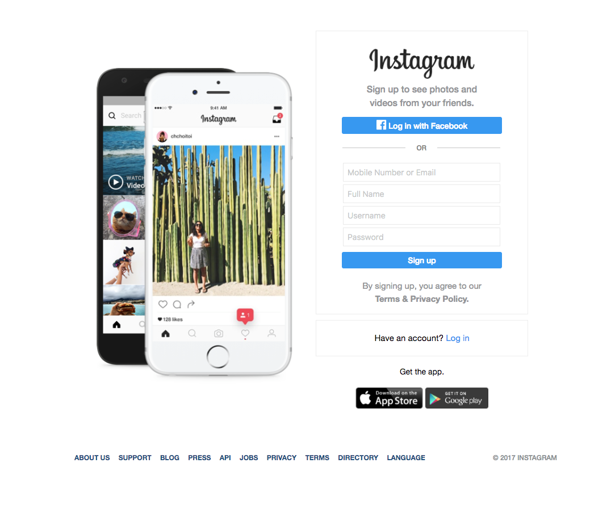

# CSS Lab

## Summary

This is the solution of creating a complex looking pages, which is not as hard as I might have thought. In this project, we will see how to recreate the following page using only CSS and HTML.

## Notes(To do this, I have to..)

* Think about the flow of the page. Avoid absolute positioning unless it is completely necessary.
* Keep your CSS as simple as possible. There are very few parts of the page that should require more than three or four lines of CSS.
* Keep your HTML simple. Think about how you could split the page in to blocks.
